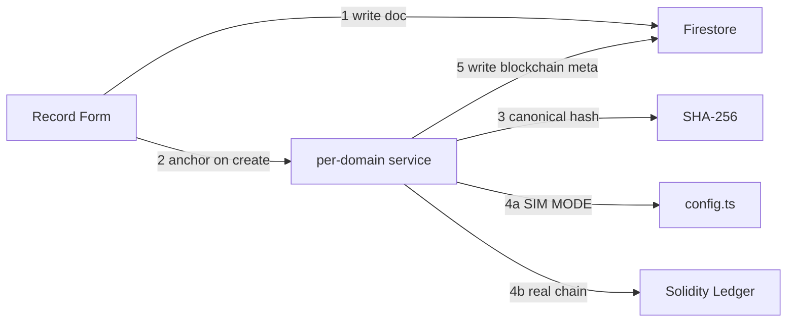
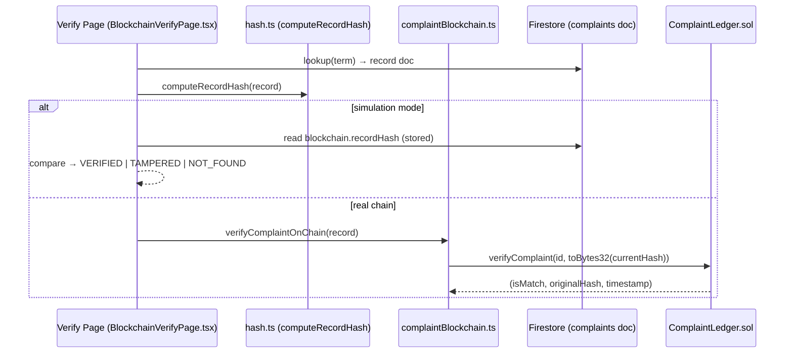

# Smart Mine — Blockchain Trust Layer Architecture

> A **hybrid blockchain trust layer**: hash-on-chain, data-on-Firebase.
> The coal-mine compliance & safety app stores full records in Firestore and
> anchors a cryptographic hash of each record to an EVM ledger, so any
> post-anchoring modification is detectable on verification.

---

## 1. Design Goals & Core Principle

| Goal | How it is met |
|------|---------------|
| **Tamper-evidence** | A SHA-256 of the canonical record is written to an on-chain ledger at record creation. Any later edit stops matching the on-chain hash. |
| **No need for a live chain to demo** | **Simulation mode.** When no contract addresses are in `.env`, every "blockchain" call returns a deterministic mock so the whole UI works offline. |
| **Keep the app fast** | Full record data stays in Firestore; only the small hash/transaction metadata goes on-chain. |
| **Deterministic & reproducible** | `canonicalStringify` sorts object keys and excludes volatile fields so any client computes the identical hash. |
| **Graceful degradation** | The blockchain layer never throws — it returns a `FAILED` / `PENDING` result that the UI renders, rather than breaking record creation. |

> The canonical/hybrid flow in one diagram (also available standalone in
> [`SMART-MINE-ARCHITECTURE.mmd`](./SMART-MINE-ARCHITECTURE.mmd)):


*(Full rendered diagram: open `SMART-MINE-ARCHITECTURE.mmd`)*

---

## 2. Repository Layout (blockchain-relevant)

```
smart-mine/
├─ contracts/                 Solidity ledger contracts (one per domain)
├─ scripts/deploy.ts          Compile + deploy + write .env addresses
├─ test/blockchain.test.ts    Solidity unit tests (15 cases)
├─ hardhat.config.cjs         CJS config (required by this ESM project)
└─ src/
   ├─ blockchain/            The blockchain module (client-side)
   │  ├─ index.ts            Public barrel export
   │  ├─ config.ts           Simulation-mode detection, chain config
   │  ├─ types.ts            BlockchainMeta / result / status types
   │  ├─ hash.ts             canonicalStringify + SHA-256 + toBytes32
   │  ├─ transaction.ts      Simulated meta/registration + idempotency
   │  ├─ contracts.ts        getContract — ABI + address lookup
   │  ├─ provider.ts         RPC provider + network status
   │  ├─ signer.ts           Browser-wallet (MetaMask) signer
   │  ├─ verifier.ts         Generic verifyRecordOnChain helper
   │  └─ services/           Per-domain anchors + verifiers
   │     ├─ attendanceBlockchain.ts
   │     ├─ inspectionBlockchain.ts
   │     ├─ complaintBlockchain.ts
   │     ├─ documentBlockchain.ts
   │     ├─ complianceBlockchain.ts
   │     ├─ auditBlockchain.ts
   │     └─ index.ts
   └─ security/
      ├─ lib/*Module.ts       Domain record create/update logic (Firestore)
      └─ components/blockchain/  Blockchain UI pages
         ├─ BlockchainDashboardPage.tsx
         ├─ BlockchainVerifyPage.tsx
         ├─ BlockchainQrPage.tsx / BlockchainQrView.tsx
         ├─ BlockchainAuditExplorerPage.tsx
         ├─ BlockchainBadges.tsx
         ├─ BlockchainMetaPanel.tsx
         └─ useBlockchainState.ts
```

---

## 3. Hashing — the heart of the trust layer

**File:** `src/blockchain/hash.ts`

- **`canonicalStringify(obj)`** (`hash.ts:10`) — sorts object keys, drops
  `undefined`/`null`, strips every key starting with `blockchain` or `_`
  (`hash.ts:21`), producing a deterministic JSON string. This is the
  **single source of truth** for the hash and is identical from any client.
- **`sha256Hex()`** (`hash.ts:31`) — uses the **Web Crypto** SHA-256; falls
  back to a pure-JS FNV-1a implementation for non-secure contexts.
- **`computeRecordHash(record)`** (`hash.ts:59`) — `sha256Hex(canonicalStringify(record))`.
  This is what both the **anchoring** and **verification** paths compute.
- **`toBytes32(hash)`** (`hash.ts:76`) — left-pads the 64-hex-char digest to
  a `0x`-prefixed `bytes32` for the Solidity ledger.

> The hash covers **every** field of the record except the embedded
> `blockchain` meta block itself and underscore-prefixed transient keys
> (`hash.ts:21`). This is the strictest trust model — a change to *any* content
> field after anchoring (including a status update) alters the recomputed hash
> and surfaces as `TAMPERED`. Nothing is excluded from the proof except the
> proof's own metadata.

---

## 4. Simulation Mode & Configuration

**File:** `src/blockchain/config.ts`

- **`simulateMode`** (`config.ts:30`) is `true` whenever no contract address
  is present in `.env` (`VITE_BLOCKCHAIN_*`).
- **`isSimulationMode()`** (`config.ts:38`) and **`isBlockchainConfigured()`**
  (`config.ts:34`) gate every code path.
- In simulation mode:
  - Anchoring returns a mock `CONFIRMED` result with a fake `txHash`,
    `blockNumber: 777` / `0` (see `transaction.ts:34` `simulatedRegistration`).
  - Verification (`verifier.ts:52`) compares the freshly computed hash against
    the record's stored `blockchain.recordHash` locally.

Transitioning to a real chain = run `npm run blockchain:deploy` to populate the
`.env` `VITE_BLOCKCHAIN_*` addresses and flip the flag off.

---

## 5. ⭐ End-to-End Trace — the Complaint → Blockchain → Verify journey

This walks a real complaint report from form to on-chain proof to tamper check,
with exact file/line references. The journey has two halves:

- **Anchoring (Steps 1–4)** — create the Firestore record, hash it, and commit
  the hash to the ledger. *Anchor wiring into the create-flows is the one
  outstanding integration step; the services below are the ready-to-use contract.*
- **Verification (Steps 5–6)** — recompute the hash at any later time and compare
  with the anchored hash to prove integrity. *This path is fully live in the UI.*

### Step 1 — User submits a complaint form
The UI calls `registerComplaint(...)` in `src/security/lib/complaintModule.ts:329`.
It builds the record `data` object (`complaintModule.ts:340-379`), inserts the
Firestore document (**`fbInsertInto('complaints', data)`** at `complaintModule.ts:386`),
then adds a status row, event, notifications, and an audit row.

> **Key point:** the complaint record *document* now lives in Firestore under
> the `complaints` collection. Its `id` is the on-chain identifier.

### Step 2 — Hash the canonical record
`registerComplaintOnChain(record)` in `src/blockchain/services/complaintBlockchain.ts:21`
computes `computeRecordHash(record)` at `complaintBlockchain.ts:22`. This uses
the deterministic `hash.ts` described in §3.

> **Integration status (current):** the per-domain `register*OnChain` services
> in `src/blockchain/services/` are defined, exported (via `services/index.ts`),
> and unit-tested, and form the required **anchor contract** — but the final
> call-site wiring (invoking them from `complaintModule.ts` / the record-creation
> flow) is the outstanding task listed under "Connect remaining domain services".
> The **verify** path below is fully live in the UI today; the **anchor** path
> becomes active the moment a create-flow calls `registerComplaintOnChain`.

### Step 3a — Simulation mode (no chain deployed)
`complaintBlockchain.ts:24-33` returns a mock:
```ts
{ ok: true, status: 'CONFIRMED', recordHash, txHash: `0x...`, blockNumber: 777, simulated: true }
```

### Step 3b — Real chain
`complaintBlockchain.ts:35` fetches the contract via `getContract('ComplaintLedger')`,
then `contract.registerComplaint(id, mineId, reporterId, toBytes32(recordHash), severity)`
(`complaintBlockchain.ts:41-47`) and waits for the receipt — capturing the real
`tx.hash` and `receipt.blockNumber` (`complaintBlockchain.ts:53-54`).

The **Solidity** side is `contracts/ComplaintLedger.sol`:
- `registerComplaint(...)` (`ComplaintLedger.sol:35`) — stores the hash in a
  `mapping(string => ComplaintEntry)` and emits `ComplaintRegistered`.
- `verifyComplaint(...)` (`ComplaintLedger.sol:56`) — reads the stored hash and
  returns `(isMatch, originalHash, timestamp)`.

### Step 4 — Persist blockchain meta back to Firestore
The anchor result (hash, tx, block, network) is written into the complaint
document's `blockchain` embedded object. This is the metadata later read by the
verify/QR/dashboard pages. (Written by the service integration — see the status
note under Step 2; the target shape is `BlockchainMeta` from
`src/blockchain/types.ts`.)

### Step 5 — Verify a complaint
Two verification paths both recompute the current hash with
`computeRecordHash(record)` and compare it to the stored/anchored hash:

- **Verify page:** `src/security/components/blockchain/BlockchainVerifyPage.tsx`
  - `lookup(term)` (`BlockchainVerifyPage.tsx:17`) searches the record across
    collections including `complaints`.
  - `evaluate(...)` (`BlockchainVerifyPage.tsx:30`) recomputes the hash
    (`BlockchainVerifyPage.tsx:31`) and compares to the stored
    `blockchain.recordHash` (`BlockchainVerifyPage.tsx:33-34`), yielding
    `VERIFIED` / `TAMPERED` / `NOT_FOUND`.
  - The result panel is rendered at `BlockchainVerifyPage.tsx:79-103`.
- **Service path:** `verifyComplaintOnChain(record)` in
  `src/blockchain/services/complaintBlockchain.ts:68`.
  - Sim mode (`complaintBlockchain.ts:71-85`) compares against meta.
  - Real chain (`complaintBlockchain.ts:91`) calls
    `contract.verifyComplaint(id, toBytes32(currentHash))` and maps `isMatch`
    to `VERIFIED` or `TAMPERED`.

### Step 6 — Tamper detection
If an attacker (or an error) edits the complaint's content fields after
anchoring, `canonicalStringify` now produces a different string ⇒ the recomputed
`currentHash` no longer equals `blockchain.recordHash` ⇒ result = `TAMPERED`
(see `BlockchainVerifyPage.tsx:34` and `complaintBlockchain.ts:93`).

### Verification flow diagram



> The same pattern repeats for every domain: **attendance**, **inspection**,
> **document**, **compliance**, and **audit** each have a
> `register*OnChain` + `verify*OnChain` pair in `src/blockchain/services/`
> and a matching Solidity ledger in `contracts/`.

---

## 6. The Blockchain UI Surface

| Page | File | Purpose |
|------|------|---------|
| Dashboard | `BlockchainDashboardPage.tsx` | Network status, metrics, recent events (feeds off `useBlockchainState`) |
| Verify Records | `BlockchainVerifyPage.tsx` | Enter any record ID → recompute hash → `VERIFIED/TAMPERED/NOT_FOUND` |
| QR Code | `BlockchainQrPage.tsx` / `BlockchainQrView.tsx` | Issue verifiable QR for a record / scan to verify |
| Audit Explorer | `BlockchainAuditExplorerPage.tsx` | Browse on-chain audit events |
| Badges & meta | `BlockchainBadges.tsx`, `BlockchainMetaPanel.tsx` | `Blockchain Verified` badges + tx/block panel on record details |

`useBlockchainState` (`useBlockchainState.ts:39`) polls provider status via
`checkNetworkStatus` / `onNetworkStatus` and aggregates metrics for the dashboard.

---

## 7. Role-Based Access

**File:** `src/security/permissions.ts`

Blockchain nav items are tiered by role:
- **workers / mining_mates / overman** → **Verify** + **QR** only (view proof).
- **mine_manager / safety_officer / super_admin** → also **Dashboard** + **Audit Trail**.

See the `permissions.ts` additions for `worker`, `mining_mate`, `overman`, and
`super_admin` nav entries.

---

## 8. How It Deploys & Runs

| Command | What it does |
|---------|--------------|
| `npm run blockchain:test` | Runs `test/blockchain.test.ts` against Hardhat (15 tests). |
| `npm run blockchain:deploy` | `scripts/deploy.ts` — compiles, deploys all ledgers locally, writes `VITE_BLOCKCHAIN_*` addresses into `.env`. |
| `npm run dev` | One-command dev orchestration: starts the Hardhat node, waits for its RPC, deploys contracts, then starts Vite. See `scripts/blockchain-dev.mjs`. |
| `npm run build` / `npx tsc --noEmit` | Type/build gate. Must stay clean. |
| `npm run dev:vite` | Vite only (simulation mode) — skips the chain. |

**ESM/CJS notes**
- This is an **ESM** Vite app, so Hardhat config lives in `hardhat.config.cjs`.
- Scripts/tests use `import hre from "hardhat"`.
- Solidity **0.8.24**; `match` is a reserved word → renamed **`isMatch`** across
  all contracts.

---

## 9. Security Notes & Trust Model

- **Hash-only on chain:** no PII is ever written to the ledger — only the
  SHA-256 digest and lightweight identifiers, so on-chain data leaks nothing.
- **Tamper-evidence** relies on the immutability of the ledger plus the
  deterministic hash: verifiers recompute and compare — no trusted third party.
- **Simulation mode** is purely a development affordance; a production install
  must supply real contract addresses and a funded signer.
- **Graceful failure:** registration/verification never throw — a network
  outage yields `PENDING`/`FAILED` shown in the UI, never a broken page.
- For a deeper run-down of the module's contracts and troubleshooting, see the
  main project `README.md`.


